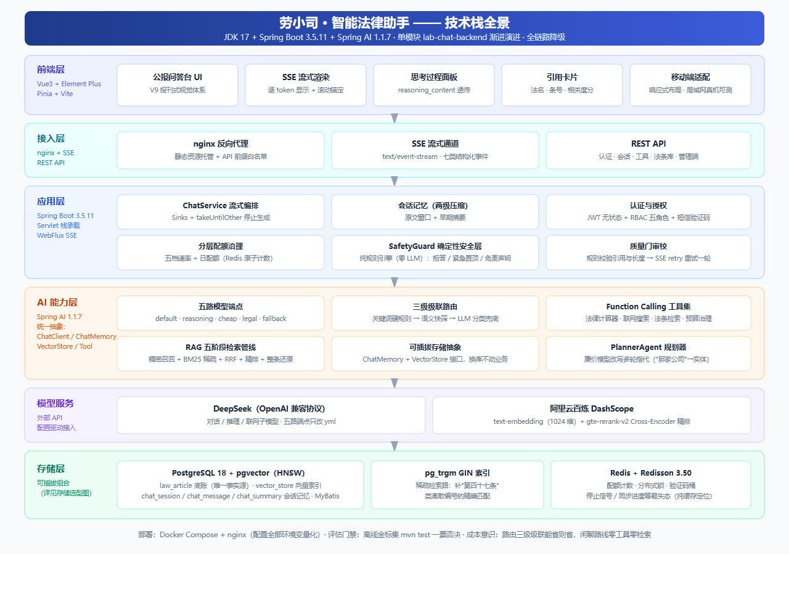
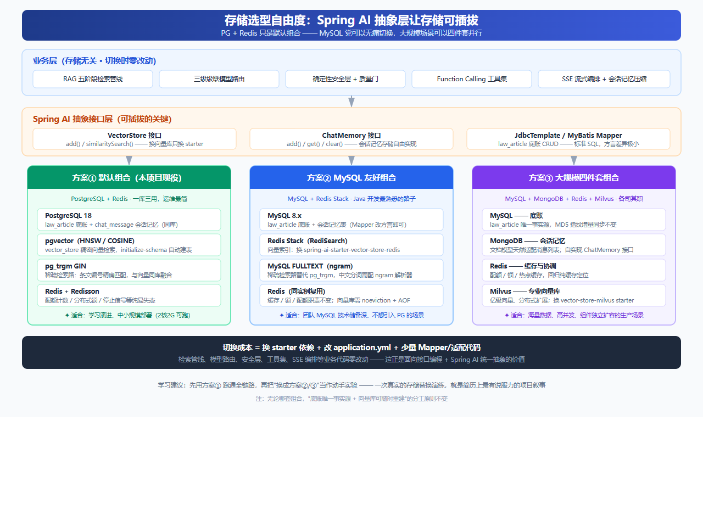
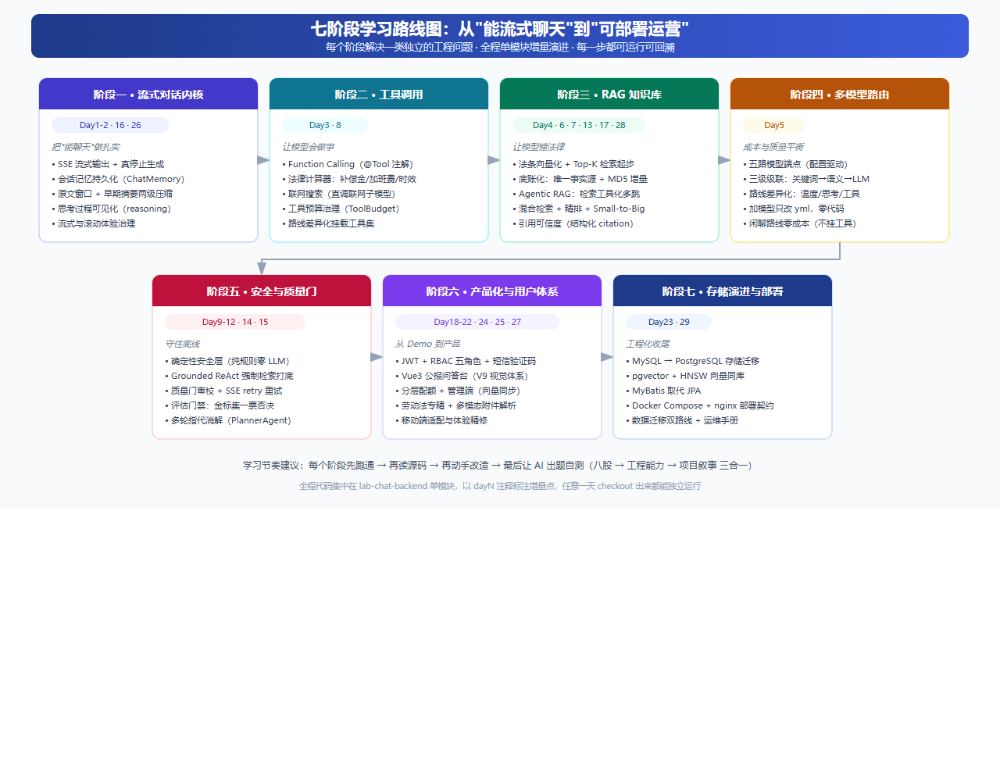

# 【Spring AI 实战 · 序章】技术栈全景与学习指南：我为什么建议你"用 AI 学 AI 项目"

> 📌 **系列说明**：本系列是一个 **Java 后端视角的 Spring AI 渐进式实战教程**。我们用一个真实可运行的开源项目——**劳小司 · 智能法律助手**——作为载体，从"能流式聊天"起步，沿着七个学习阶段，一步步把它演进为一个**劳动法专精、引用可溯源、可部署运营**的法律 AI 助手。法律业务只是承载 AI 能力的场景外壳，每一站解决的都是一类独立的工程问题。
>
> - **序章（本文）**：项目介绍 + 技术栈全景 + 用 AI 学习本项目的方法论 + 存储选型自由度
> - Day1：SSE 流式聊天 + 真正的"停止生成"
> - Day2：会话记忆持久化（重启不丢记忆）
> - Day3：Function Calling 工具调用
> - Day4：RAG 检索增强（让模型"有法可依"）
> - Day5：五路模型级联路由（成本与质量平衡）
> - Day6：知识库底账化与 MD5 增量导入
> - Day7：Agentic RAG 检索工具化
> - Day8：框架升级与联网搜索
> - Day9：确定性安全层（纯规则引擎兜底）
> - Day10：Grounded ReAct 强制检索打底
> - Day11：评估门禁（金标集一票否决）
> - Day12~17：质量门协作链 / 引用可信度 / 多轮指代消解 / 阻塞隔离 / 思考可见化 / 检索质量工程
> - Day18~22：用户体系与认证 / 公报问答台前端 / 律师模式门禁 / 分层配额 / 劳动法专精与多模态附件
> - Day23~29：存储层迁移 / 附件深水区 / 移动端精修 / 流式滚动治理 / 身份头像 / 知识库体验 / 部署契约
>
> 📦 **代码说明**：全部代码开源，集中在 `lab-chat-backend` 单模块按 day 增量演进，增量点均以注释标注，任意一天 checkout 出来都能独立运行。

---

> 🌐 **在线体验与源码**
>
> | 入口 | 地址 |
> | --- | --- |
> | 在线演示（2 核 4G 单机跑全栈） | http://39.105.23.48 |
> | GitHub | https://github.com/spaserby/laoxiaosi.git |
> | Gitee（国内克隆更快） | https://gitee.com/spaserby/laoxiaosi.git |
>
> 如果这个项目或这个系列帮到了你，**顺手点颗 Star ⭐** 就是对我最大的鼓励。

---

## 一、这个项目是什么

**劳小司**是一个劳动法专精的 AI 法律助手。你问它"被公司辞退能拿多少补偿"，它不会张口就来一个数字，而是：

1. 先去**法条知识库**里检索《劳动合同法》第四十七条原文；
2. 用**法律计算器**按你的工龄和月薪算出 N、N+1、2N 三档金额；
3. 把**法名、条号、出处、相关度分**作为引用卡片附在回答后面，点一下就能核对原文。

它正面回应了大模型做法律问答的两个硬伤：

| 硬伤 | 表现 | 本项目的对策 |
| --- | --- | --- |
| **幻觉** | 条文编号、补偿月数张口就来，无法验证 | 强制检索打底 + 引用可信度结构化输出 |
| **不可更新** | 知识停在训练截止日，自有数据装不进去 | 法条底账 + 向量化增量同步，随时可重建 |

但法律只是外壳。这个项目真正的内核，是一条完整的 **Spring AI 工程化学习路径**：流式对话、工具调用、RAG、多模型路由、安全兜底、质量门禁、产品化、部署——每一站解决一类独立的工程问题，且**每一步都可运行、可回溯、可单独讲清楚**。

## 二、技术栈全景



一张表看懂选型与理由：

| 层级 | 技术 | 一句话理由 |
| --- | --- | --- |
| 语言 / 框架 | JDK 17 + Spring Boot 3.5.11 + Spring AI 1.1.7 | Servlet 栈承载业务，WebFlux 只用于 SSE 流式，不混栈 |
| Chat 模型 | DeepSeek（OpenAI 兼容协议） | 五路端点配置驱动，加一个模型只改 yml |
| Embedding | 百炼 text-embedding（1024 维） | 中文语义效果好，按量计费便宜 |
| Rerank | 百炼 gte-rerank-v2 | Cross-Encoder 精排，检索质量的关键一跃 |
| 知识库 | PostgreSQL 18 + pgvector（HNSW）+ MyBatis | 底账 / 向量 / 会话记忆同库，运维最简 |
| 缓存 | Redis + Redisson 3.50 | 配额计数 / 分布式锁 / 停止信号等易失态 |
| 认证 | Spring Security + JWT + 阿里云短信 | 无状态认证 + RBAC 五角色 |
| 前端 | Vue3 + Element Plus + Pinia + Vite | SSE 流式渲染 + 思考面板 + 引用卡片 |
| 部署 | Docker Compose + nginx | 配置全部环境变量化，仓库内零密钥 |

> ⚠️ 看到 PostgreSQL 先别划走——**存储是可插拔的**，MySQL 党完全能无痛上手，详见第五节。

## 三、这个项目的七个"不一样"

市面上"Spring AI 入门"教程很多，但大多停在"调通一个 demo"。这个项目想给你的是**工程化的完整闭环**，七个差异化设计：

**① 引用可溯源，不玩"AI 说的"**
回答附结构化 `citation` 事件（法名 / 条号 / 出处 / 相关度分），前端渲染成可展开的引用卡片。模型说的每句话，你都能点回去核对原文。

**② 确定性安全层：不让 LLM 自己看守自己**
拒答拦截、紧急提示置顶、免责声明附加，全部由**纯规则引擎**（零 LLM 调用）100% 保证。安全底线不指望提示词软约束下模型"自觉"。

**③ 强制检索打底：代码层堵幻觉**
严肃法律路线在进模型之前，代码层**必检一次**知识库（Grounded ReAct），堵住"模型觉得自己知道就跳过检索"的幻觉通道。

**④ 成本意识贯穿始终**
五路模型端点 + 三级级联路由（关键词硬规则 → 语义快筛 → LLM 分类兜底），能省则省；闲聊路线不挂检索工具，零额外成本。

**⑤ 质量门禁：mvn test 一票否决**
离线金标集作为评估门禁，安全 / 路由 / 引用格式不达标直接构建失败。AI 应用也能有"测试驱动"的底气。

**⑥ 单模块渐进演进，每一步可回溯**
全量代码在一个模块里按 day 叠加，增量点以注释标注。不是"大爆炸式"甩给你最终态，而是能看清**每一步为什么这么改**。

**⑦ 全链路降级：故障只告警不阻断**
检索挂了、精排挂了、路由挂了——任一环节失败都降级为纯 LLM 对话并记录告警，主流程永远不断。这是生产级 AI 应用和 demo 的分水岭。

## 四、我推荐你用 AI 来学习本项目

这一节是序章最想传达的观点：**学 AI 项目，最好的老师就是 AI 本身。**

原因很现实：这个项目涉及大量你未必接触过的新概念（Embedding、Rerank、Function Calling、Reactor、SSE、向量索引……），靠逐行读源码硬啃效率极低；而 AI 恰好擅长"把一段陌生代码用你熟悉的方式讲清楚"。下面是五种经过验证的玩法：

### 4.1 让 AI 当导读员

把某个类丢给 AI，让它先给你建立心智模型，再自己读代码验证：

```
请用 5 分钟帮我讲清 ChatService 这个类：
1) 它的核心职责是什么（一句话）
2) 一次流式请求的数据流经过哪几步
3) 哪三行代码是理解它的关键
讲完先不要给改进建议。
```

### 4.2 让 AI 出题自测（八股 → 工程 → 叙事三合一）

每学完一个阶段，让 AI 出面试题逼自己输出：

```
我刚学完"三级级联模型路由"（关键词硬规则 → 语义向量快筛 → LLM 分类兜底）。
请出 8 道面试题：3 道八股概念、3 道工程权衡（为什么这么设计）、2 道追问式深挖。
每题先给考察点，我回答后你再点评。
```

这一步的价值在于：面试官问的从来不是"你用了什么"，而是"**你为什么不用别的**"。

### 4.3 让 AI 陪改不代劳

动手实验时约束 AI 只给思路：

```
我想给检索管线加一路"标题精确匹配"召回。
只给我修改思路和需要动的文件清单，不要直接写代码，我自己实现。
```

### 4.4 让 AI 陪你排障

报错先喂给 AI 分析根因，再自己验证——把排障也变成学习：

```
启动报 VectorStore bean not found，堆栈如下：[粘贴]
请列出 3 个可能的根因，按概率排序，并告诉我每个根因的验证方法。
```

### 4.5 让 AI 做替换演练（本文第五节的延伸）

```
如果把本项目的向量库从 pgvector 换成 Milvus，
请列出需要改动的依赖、配置、代码文件，以及哪些代码可以完全不动，并解释原因。
```

> 💡 一个心法：**先让 AI 讲，再自己读码验证，最后让 AI 出题考你**。三步闭环下来，一个概念才算真正长在你身上。AI 负责降低理解成本，你负责建立判断力。

## 五、存储选型自由度：PG + Redis 不是唯一解

很多 Java 同学看到 PostgreSQL 会本能地想："我更熟 MySQL，能不能不换？"

**能。而且这正是本项目想教你的设计思想：存储可插拔。**



可插拔的底气来自 Spring AI 的统一抽象：

| 抽象 | 职责 | 换存储的代价 |
| --- | --- | --- |
| `VectorStore` | `add()` / `similaritySearch()`，屏蔽各家向量库 | 换一个 starter + 改配置 |
| `ChatMemory` | `add()` / `get()` / `clear()`，会话记忆读写 | 自己实现接口或换实现类 |
| MyBatis Mapper | `law_article` 底账 CRUD | 标准 SQL，方言差异极小 |

于是你可以按需组合三套方案：

**方案① 默认组合（本项目现役）：PostgreSQL + Redis —— 为“最小运维成本”而生**
选它不是信仰，而是算账：底账、向量（pgvector HNSW）、会话记忆**三件事共用一个 PG 实例**，Redis 只管配额 / 锁 / 易失态——整套系统只有两个有状态组件要养，备份、监控、升级都只面对两套东西。2 核 2G 小服务器就能跑，适合学习和中小规模部署。**“少养一个组件，就少一类运维事故”**，这就是默认组合选 PG + Redis 的全部理由：不是它最强，而是它让运维成本最低。

**方案② MySQL 友好组合：MySQL + Redis —— 完全可以不装 PostgreSQL**
底账和会话记忆放 MySQL（Mapper 改方言即可），向量换 `spring-ai-starter-vector-store-redis`（Redis Stack 的 RediSearch 模块），稀疏检索路用 MySQL FULLTEXT（ngram）替代 pg_trgm。**对 MySQL 技术储备深的团队，这条路零学习成本。**

特别说一句：如果你熟悉的就是 MySQL + Redis 这一对，手上有一台 **2 核 4G** 的服务器（或者干脆是自己的本地机器），**完全可以不碰 PostgreSQL**——MySQL 存底账和会话记忆、Redis Stack 兼作向量库，两个你天天打交道的组件就能把整个项目跑起来，本地开发和服务器部署都一样。不必为了学一个 AI 项目，先背一门新数据库的运维。

**方案③ 大规模四件套：MySQL + MongoDB + Redis + Milvus**
底账 MySQL（唯一事实源）、会话记忆 MongoDB（文档模型天然适配消息列表）、缓存 Redis、向量 Milvus（亿级向量、分布式扩展）。组件各司其职、独立扩容，适合海量数据与高并发的生产场景。

**无论选哪套，两条原则不变：**

1. **底账是唯一事实源，向量库只是可随时重建的检索索引**——所以换向量库不心疼，重嵌一次即可；
2. **业务层零改动**——检索管线、模型路由、安全层、工具集、SSE 编排都不感知存储变化。切换成本 = 换 starter + 改 yml + 少量适配代码。

> 💪 给 MySQL 党的建议：先用方案① 跑通全链路，再把"换成方案②/③"当作一次动手实验。一次真实的存储替换演练，就是简历上最有说服力的项目叙事——因为它同时证明了你的**抽象设计能力**和**动手落地能力**。

## 六、学习路线图：七个阶段，从"能聊天"到"可运营"



| 阶段 | 解决的工程问题 | 对应 Day |
| --- | --- | --- |
| 一 · 流式对话内核 | 把"能聊天"做扎实：SSE、停止生成、会话记忆、思考可见化 | 1-2, 16, 26 |
| 二 · 工具调用 | 让模型会做事：Function Calling、法律计算器、联网搜索、工具预算 | 3, 8 |
| 三 · RAG 知识库 | 让模型懂法律：向量化、底账化、Agentic RAG、检索质量、引用可信度 | 4, 6, 7, 13, 17, 28 |
| 四 · 多模型路由 | 成本与质量平衡：五路端点、三级级联、路线差异化 | 5 |
| 五 · 安全与质量门 | 守住底线：确定性安全层、强制检索、质量门、评估门禁、指代消解 | 9-12, 14, 15 |
| 六 · 产品化与用户体系 | 从 Demo 到产品：认证、前端、配额、劳动法专精、多模态、移动端 | 18-22, 24, 25, 27 |
| 七 · 存储演进与部署 | 工程化收尾：存储迁移、Docker Compose、nginx、运维手册 | 23, 29 |

**推荐的学习节奏**：每个阶段先跑通 → 再读源码 → 再动手改造 → 最后用第四节的方法让 AI 出题自测。跑通建立手感，读码建立理解，改造建立肌肉记忆，自测建立表达力。

## 七、快速开始

```bash
# 1. 拉起基础设施（PG + pgvector + Redis；首次启动自动执行 db/init.sql 建表并导入法条）
docker compose up -d

# 2. 注入密钥后启动后端（仓库内零密钥，真实值只存环境变量）
export DEEPSEEK_API_KEY=sk-xxx        # 你的 DeepSeek key
export DASHSCOPE_API_KEY=sk-xxx       # embedding + rerank
export PG_PASSWORD=your-pg-password
export REDIS_PASSWORD=your-redis-password
mvn spring-boot:run -pl lab-chat-backend

# 3. 前端（另开终端）
cd super-law-frontend && npm install && npm run dev
# 浏览器打开 http://localhost:5173
```

> 本机已有 PG / Redis 可跳过第 1 步，手动执行 `db/init.sql` 即可；无 psql 环境（如 Windows 沙箱）可用仓库自带的 `scripts/RunInitSql.java` 走 JDBC 通道。

## 八、写在最后

这个系列不打算教你"背概念"，而是带你**把一个 AI 应用从 0 做到能上线、能运营、能讲清楚**。序章先把地图铺开：技术栈长什么样、有哪些设计取舍、存储能怎么换、以及——最重要的——怎么用 AI 这个杠杆把学习效率拉满。

下一篇 **Day1**，我们从最基础也最容易做糙的一件事开始：**SSE 流式聊天，以及一个“真正的”停止生成**——点停止之后，大模型侧的生成也被中断，而不只是前端不显示了。这一点，很多教程都没讲透。

最后再放一次入口，方便你边读边玩：

- 在线演示：http://39.105.23.48
- GitHub：https://github.com/spaserby/laoxiaosi.git
- Gitee：https://gitee.com/spaserby/laoxiaosi.git

**如果这个系列对你有点帮助，帮我点颗 Star ⭐ 吧**——开源不易，你的每一颗星都是我更新下一篇的动力。

---

> 📎 **配图说明**：本文三张配图的 SVG 源文件在仓库 `blog/assets/` 下（`day0-tech-stack-overview.svg` / `day0-storage-options.svg` / `day0-learning-roadmap.svg`），渲染后的 PNG 在 `blog/assets/images/` 下，可自由修改复用。
